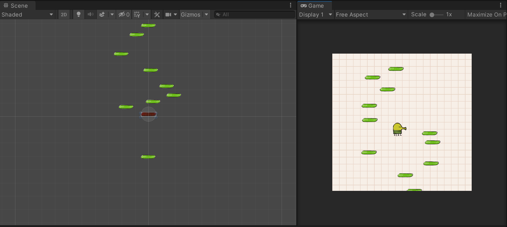

# Unity Tutorial: Doodle Jump Replica

This is a tutorial project based on Brackey's Unity Tutorial on Doodle Jump Replica. The key purpose of this project is to understand how to develop 2D Platform Jumping Game in Unity. All credits goes to [Brackeys](https://www.youtube.com/watch?v=fHN-26GEVhA)

## Content Covered

- How to generate platforms on game start (not the best for infinite scroll game)
- How to move camera with character
- How to make character jump